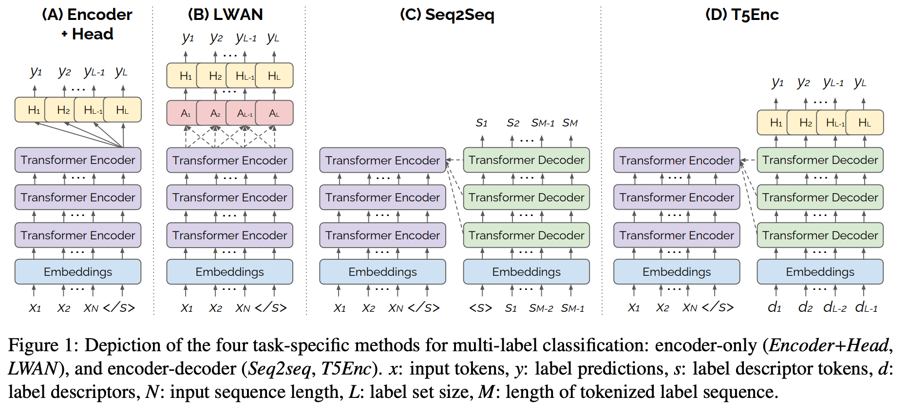

# An Exploration of Encoder-Decoder Approaches to Multi-Label Classification for Legal and Biomedical Text


## Introduction

Standard methods for multi-label text classification largely rely on encoder-only pretrained language models, whereas encoder-decoder models have proven more effective in other classification tasks. In this study,
we compare four methods for multi-label classification, two based on an encoder only, and two based on an encoder-decoder. We carry out experiments on four datasets —two in the legal domain and two in the biomedical domain, each with two levels of label granularity— and always depart from the same pre-trained model, T5. Our results show that encoder-decoder methods outperform encoder only methods, with a growing advantage on more complex datasets and labeling schemes of finer granularity. Using encoder-decoder models in a non-autoregressive fashion, in particular, yields the best performance overall, so we further study this approach through ablations to better understand its strengths.



### Citation

[*Yova Kementchedjhieva and Ilias Chalkidis. 2023. An Exploration of Encoder-Decoder Approaches to Multi-Label Classification for Legal and Biomedical Text. In Findings of the Association for Computational Linguistics: ACL 2023, pages 5828–5843, Toronto, Canada. Association for Computational Linguistics.*](https://aclanthology.org/2023.findings-acl.360/)
```
@inproceedings{kementchedjhieva-chalkidis-2023-exploration,
    title = "An Exploration of Encoder-Decoder Approaches to Multi-Label Classification for Legal and Biomedical Text",
    author = "Kementchedjhieva, Yova  and
      Chalkidis, Ilias",
    booktitle = "Findings of the Association for Computational Linguistics: ACL 2023",
    month = jul,
    year = "2023",
    address = "Toronto, Canada",
    publisher = "Association for Computational Linguistics",
    url = "https://aclanthology.org/2023.findings-acl.360",
    pages = "5828--5843"
}
```

## Datasets

### Dataset Specifications

| Dataset Name                                                                                                        | Version     | Taxonomy       | #Labels |
|---------------------------------------------------------------------------------------------------------------------|-------------|----------------|---------|
| EURLEX ([Chalkidis et al., 2021](https://aclanthology.org/2021.emnlp-main.559/))                                    | `eurlex-l1` | EUROVOC        | 21      |
| EURLEX ([Chalkidis et al., 2021](https://aclanthology.org/2021.emnlp-main.559/))                                    | `eurlex-l2` | EUROVOC        | 127     |
| UKLEX  ([Chalkidis et al., 2022](https://aclanthology.org/2022.findings-acl.192/))                                  | `uklex-l1`  | UK LEGISLATION | 18      |
| UKLEX  ([Chalkidis et al., 2022](https://aclanthology.org/2022.findings-acl.192/))                                  | `uklex-l2`  | UK LEGISLATION | 40      |
| BIOASQ ([Tsatsaronis et al., 2015](https://bmcbioinformatics.biomedcentral.com/articles/10.1186/s12859-015-0564-6)) | `bioasq-l1` | MESH           | 16      |
| BIOASQ ([Tsatsaronis et al., 2015](https://bmcbioinformatics.biomedcentral.com/articles/10.1186/s12859-015-0564-6)) | `bioasq-l2` | MESH           | 112     |
| MIMIC  ([Johnson et al., 2016](https://www.nature.com/articles/sdata201635))                                        | `mimic-l1`  | ICD-9          | 19      |
| MIMIC  ([Johnson et al., 2016](https://www.nature.com/articles/sdata201635))                                        | `mimic-l2`  | ICD-9          | 184     |

### Usage

```python
from datasets import load_dataset
dataset = load_dataset('kiddothe2b/multilabel_bench', name='mimic-l1')
```

## Code Demo

To run experiments please use the `train_classifier.sh` shell script, which you can parameterize to test different models, and datasets using the `train_classifier.py`:

```
MODEL_NAME='t5-base'
BATCH_SIZE=16
DATASET='uklex-l1'
USE_LWAN=false
USE_T5ENC2DEC=true
SEQ2SEQ=false
GEN_MAX_LENGTH=32
T5ENC2DEC_MODE='multi-step'
TRAINING_MODE='t5enc-multi'
OPTIMIZER='adafactor'
SCHEDULER='constant_with_warmup'
LEARNING_RATE=1e-4
```

### Requirements

```
torch==1.12.0
transformers==4.20.0
datasets==2.6.1
scikit-learn==1.0.0
tqdm>=4.62.0
wandb>=0.12.0
```


